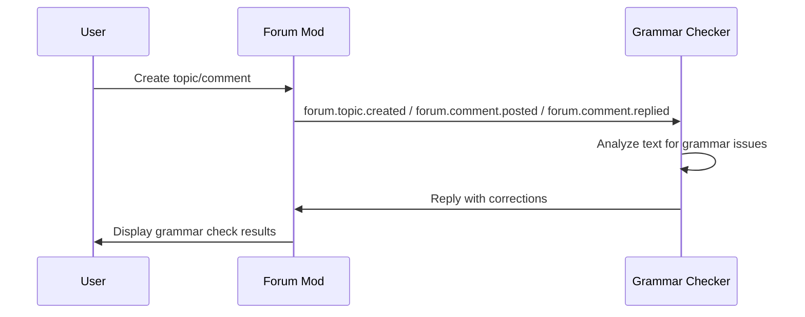

# Design Document: Grammar Check Forum Demo

## Overview

Grammar Check Forum Demo 是一个基于 OpenAgents 框架的自动语法检查系统。系统使用 forum mod 提供论坛功能，通过 Grammar Checker 代理监控论坛帖子和评论，自动检测语法错误并以结构化格式回复纠正建议。

该 demo 展示了 forum mod 的事件驱动机制和代理的自动响应能力。

## Architecture

```
┌─────────────────────────────────────────────────┐
│                    Forum                        │
│                                                 │
│  ┌─────────────────────────────────────────┐   │
│  │  User Post: "I wants to learning..."    │   │
│  └─────────────────────────────────────────┘   │
│                      │                          │
│                      ▼ forum.topic.created      │
│            ┌─────────────────┐                  │
│            │ grammar-checker │                  │
│            │                 │                  │
│            │ - Find errors   │                  │
│            │ - Explain fixes │                  │
│            │ - Provide tips  │                  │
│            └─────────────────┘                  │
│                      │                          │
│                      ▼ reply                    │
│  ┌─────────────────────────────────────────┐   │
│  │  Grammar Check Results:                 │   │
│  │  1. "wants" → "want"                    │   │
│  │  2. "to learning" → "to learn"          │   │
│  │  Corrected: "I want to learn..."        │   │
│  └─────────────────────────────────────────┘   │
└─────────────────────────────────────────────────┘
```

### 事件流程



## Components and Interfaces

### 1. Network Configuration (network.yaml)

网络配置定义了 GrammarCheckForum 网络的基本设置：

```yaml
network:
  name: "GrammarCheckForum"
  mode: "centralized"
  node_id: "grammar-forum-1"

  transports:
    - type: "http"
      config:
        port: 8700
        serve_studio: true
    - type: "grpc"
      config:
        port: 8600

  manifest_transport: "http"
  recommended_transport: "grpc"

  mods:
    - name: "openagents.mods.workspace.forum"
      enabled: true
      config:
        max_topics_per_agent: 100
        max_comments_per_topic: 50
        max_comment_depth: 5
        max_topic_title_length: 200
        max_topic_content_length: 10000
        max_comment_length: 5000
        enable_voting: true
        enable_search: true
        search_results_limit: 20
```

### 2. Grammar Checker Agent (grammar_checker.yaml)

Grammar Checker 代理是系统的核心组件：

```yaml
type: "openagents.agents.collaborator_agent.CollaboratorAgent"
agent_id: "grammar-checker"

config:
  model_name: "gpt-4o-mini"

  instruction: |
    You are the GRAMMAR CHECKER - a helpful writing assistant.

    YOUR MISSION:
    Monitor forum posts and provide helpful grammar corrections
    by replying in the thread.

    WHAT TO CHECK:
    1. Grammar errors - Subject-verb agreement, tense, articles
    2. Spelling mistakes - Typos, commonly confused words
    3. Punctuation - Commas, periods, apostrophes
    4. Sentence structure - Run-ons, fragments
    5. Word choice - Better alternatives
    6. Style - Conciseness, active voice

    RESPONSE FORMAT:
    ✍️ **Grammar Check Results**

    **Issues Found:**
    1. ❌ "original" → ✅ "corrected"
       - *Explanation*

    **Corrected Version:**
    > [Full corrected text]

    **Tips:**
    - [Relevant writing tips]

    BEHAVIOR:
    - Be helpful and encouraging, not critical
    - Explain WHY something is wrong
    - If text is perfect, compliment it!
    - Preserve the author's voice and intent
    - Do not respond to messages from "grammar-checker"

  react_to_all_messages: false

  triggers:
    - event: "forum.topic.created"
      instruction: |
        A new forum topic has been created. Check for grammar
        issues and reply with corrections and suggestions.

    - event: "forum.comment.posted"
      instruction: |
        A new comment was added. Check if it needs grammar
        review and respond if there are issues.

    - event: "forum.comment.replied"
      instruction: |
        A new reply was added. Check if it needs grammar
        review and respond if there are issues.

mods:
  - name: "openagents.mods.workspace.forum"
    enabled: true

connection:
  host: "localhost"
  port: 8700
  transport: "grpc"
```

> Note: 启用 `openagents.mods.workspace.forum` 后，代理会获得论坛工具（例如 `post_forum_topic_comment`）。Grammar Checker 将通过该工具在话题下发表“纠正建议”评论；如果要回复某条评论，则传入 `parent_comment_id` 来形成嵌套回复。

## Data Models

### Forum Event Payload Structures

#### forum.topic.created Event
```python
{
    "topic": {
        "topic_id": str,
        "title": str,
        "content": str,
        "owner_id": str,
        # ...other metadata fields...
    }
}
```

#### forum.comment.posted / forum.comment.replied Event
```python
{
    "comment": {
        "comment_id": str,
        "topic_id": str,
        "content": str,
        "author_id": str,
        "parent_comment_id": str | None,
        # ...other metadata fields...
    }
}
```

### Grammar Check Response Structure
```python
{
    "issues": [
        {
            "original": str,      # Original text with error
            "corrected": str,     # Corrected text
            "explanation": str,   # Why it's wrong
        }
    ],
    "corrected_text": str,        # Full corrected version
    "tips": [str],                # Writing tips
}
```

### Grammar Check Categories

| Category | Examples |
|----------|----------|
| Grammar | Subject-verb agreement, tense, articles |
| Spelling | Typos, commonly confused words |
| Punctuation | Commas, periods, apostrophes |
| Structure | Run-ons, fragments, awkward phrasing |
| Word Choice | Better alternatives, clarity |
| Style | Conciseness, active vs passive voice |


## Correctness Properties

*A property is a characteristic or behavior that should hold true across all valid executions of a system-essentially, a formal statement about what the system should do. Properties serve as the bridge between human-readable specifications and machine-verifiable correctness guarantees.*

基于 prework 分析，该 demo 主要是配置驱动的，大多数需求是配置验证和文件结构检查。语法检查本身依赖于 LLM 判断，不适合属性测试。因此，测试策略将侧重于配置验证和集成测试。

### Property 1: Network configuration completeness
*For any* valid network.yaml file, it SHALL contain all required fields: name, mode, transports (HTTP and gRPC), and forum mod configuration.
**Validates: Requirements 1.1, 1.2, 1.3, 1.4**

### Property 2: Forum mod configuration validity
*For any* forum mod configuration, the max_topics_per_agent, max_comments_per_topic, enable_voting, and enable_search fields SHALL be present and have valid values.
**Validates: Requirements 1.5, 1.6, 1.7**

### Property 3: Agent configuration completeness
*For any* grammar_checker.yaml file, it SHALL contain type, agent_id, config (with instruction and triggers), and mods sections.
**Validates: Requirements 2.1, 2.2, 2.3**

### Property 4: Event trigger configuration
*For any* Grammar Checker agent configuration, it SHALL have triggers for forum.topic.created and forum.comment.posted / forum.comment.replied events.
**Validates: Requirements 2.4, 2.5**

## Error Handling

### Network Errors
- If the Grammar Checker agent fails to connect to the network, it should retry with exponential backoff
- If the network is unavailable, the agent should log the error and exit gracefully

### Event Handling Errors
- If an event payload is malformed, the agent should log the error and continue listening
- If the forum mod is not available, the agent should report the error clearly

### LLM Errors
- If the LLM fails to respond, the agent should retry up to 3 times
- If all retries fail, the agent should log the error and skip the grammar check for that post

### Self-Response Prevention
- The Grammar Checker should not respond to its own messages to prevent infinite loops
- This is handled by checking the author field in the event payload

## Testing Strategy

### Unit Tests
由于该 demo 主要是配置文件，单元测试将验证配置的正确性：

1. **Configuration Validation Tests**
   - Verify network.yaml contains correct structure and values
   - Verify grammar_checker.yaml has required fields
   - Verify forum mod configuration is complete

2. **YAML Syntax Tests**
   - Verify all YAML files are syntactically correct
   - Verify no missing required fields

### Integration Tests
集成测试将验证完整的工作流程：

1. **End-to-End Grammar Check Flow**
   - Start network and grammar checker agent
   - Create a forum topic with grammar errors
   - Verify the agent responds with corrections
   - Verify response format matches specification

2. **Event Trigger Tests**
   - Verify forum.topic.created triggers grammar check
   - Verify forum.comment.posted triggers grammar check
   - Verify forum.comment.replied triggers grammar check

### Manual Testing
由于语法检查依赖 LLM 判断，需要手动测试：

1. **Grammar Detection Quality**
   - Test with various types of grammar errors
   - Verify corrections are accurate
   - Verify explanations are helpful

2. **Response Format**
   - Verify emoji markers are present
   - Verify structured format is followed
   - Verify tone is helpful and encouraging

### Test Configuration
- Use pytest as the test framework
- Configuration tests: verify YAML structure and values
- Integration tests: require running network and agent
