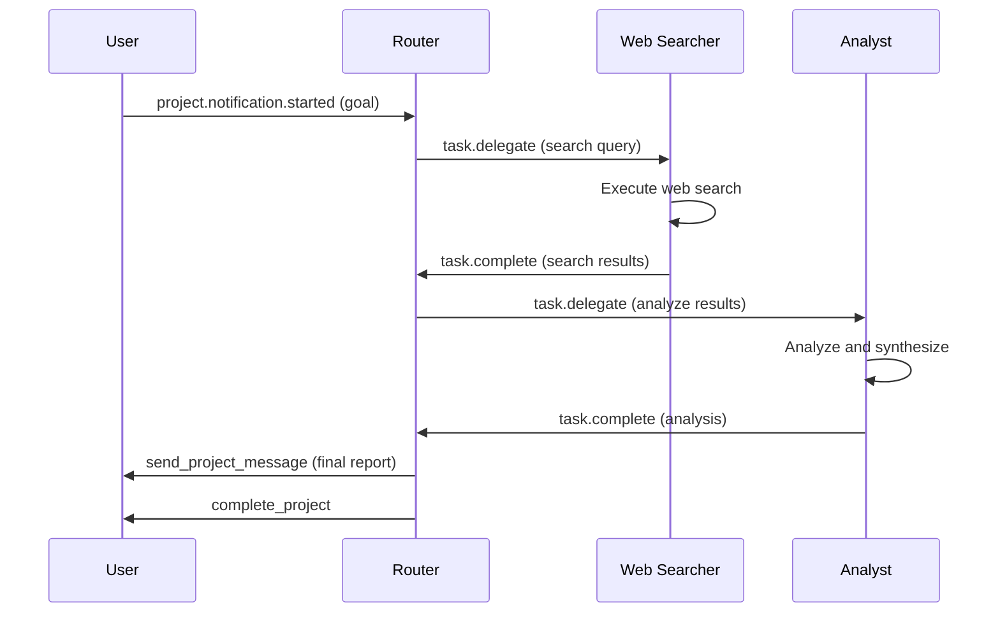

# Design Document: Research Team Demo

## Overview

Research Team Demo 是一个基于 OpenAgents 框架的多代理协作研究系统。系统采用 Router 模式，由一个协调器代理（Router）接收研究请求，并将任务委派给专业代理（Web Searcher 和 Analyst）执行，最终汇总结果返回给用户。

系统使用 project mod 进行任务管理，支持项目模板、事件驱动的任务委派和代理分组权限控制。

## Architecture

```
                    ┌─────────────────┐
    Research        │     Router      │
    Request    ────►│  (coordinator)  │
                    └────────┬────────┘
                             │ task.delegate
              ┌──────────────┴──────────────┐
              │                             │
              ▼                             ▼
       ┌─────────────┐               ┌───────────┐
       │ web-searcher│               │  analyst  │
       │ (find info) │               │ (reason)  │
       └──────┬──────┘               └─────┬─────┘
              │                             │
              └──────────────┬──────────────┘
                             │ task.complete
                             ▼
                    ┌─────────────────┐
                    │     Router      │
                    │ (compile report)│
                    └─────────────────┘
```

### 事件流程



## Components and Interfaces

### 1. Network Configuration (network.yaml)

网络配置定义了 ResearchTeam 网络的基本设置：

```yaml
network:
  name: "ResearchTeam"
  mode: "centralized"
  node_id: "research-team-1"

  transports:
    - type: "http"
      config:
        port: 8700
        serve_studio: true
    - type: "grpc"
      config:
        port: 8600

  manifest_transport: "http"
  recommended_transport: "grpc"

  default_agent_group: guest

  agent_groups:
    coordinators:
      description: "Router agents that coordinate research tasks"
    researchers:
      description: "Worker agents that execute research tasks"

  mods:
    - name: "openagents.mods.workspace.default"
      enabled: true
      config:
        custom_events_enabled: true

    - name: "openagents.mods.workspace.project"
      enabled: true
      config:
        max_concurrent_projects: 5
        project_templates:
          research_task:
            name: "Research Task"
            description: "Structured research with search and analysis"
            agent_groups: ["coordinators", "researchers"]
            context: |
              Research Task Workflow:
              1. Router receives request and delegates search
              2. Web-searcher returns findings
              3. Router delegates analysis
              4. Analyst synthesizes conclusions
              5. Router compiles final report
```

### 2. Router Agent (router.yaml)

Router 代理是系统的协调中心：

```yaml
type: "openagents.agents.collaborator_agent.CollaboratorAgent"
agent_id: "router"

config:
  model_name: "glm-4.7"
  max_iterations: 3

  instruction: |
    You are the ROUTER - a simple coordinator.
    Make ONE action per event, then call finish().

    YOUR TOOLS:
    - send_project_message(project_id, content) - message the user
    - send_event(event_name, destination_id, payload) - delegate tasks
    - complete_project(project_id, summary) - finish the project
    - finish() - MUST call this last

    RULE: Make ONE tool call, then call finish(). Never call send_event twice.

  react_to_all_messages: false

  triggers:
    - event: "project.notification.started"
      instruction: |
        Project started. Do these 2 things IN ORDER:
        1. send_event(event_name="task.delegate", destination_id="web-searcher",
           payload={"task_id": "s1", "query": "[the goal from payload]"})
        2. finish()

    - event: "task.complete"
      instruction: |
        A task completed. Check who sent it:

        IF source is "web-searcher":
        1. send_event to analyst with the results
        2. finish()

        IF source is "analyst":
        1. send_project_message with summary
        2. complete_project
        3. finish()

mods:
  - name: "openagents.mods.workspace.project"
    enabled: true
  - name: "openagents.mods.workspace.default"
    enabled: true

connection:
  host: "localhost"
  port: 8700
  transport: "grpc"
  agent_group: "coordinators"
```

### 3. Web Searcher Agent (web_searcher.yaml)

Web Searcher 代理负责信息收集：

```yaml
type: "openagents.agents.collaborator_agent.CollaboratorAgent"
agent_id: "web-searcher"

config:
  model_name: "glm-4.7"

  instruction: |
    You are the WEB SEARCHER - an information gatherer.
    
    When you receive a task.delegate event:
    1. Use your search tools to find relevant information
    2. Compile the findings into a structured format
    3. Send task.complete event back to router with results
    4. Call finish()

    YOUR TOOLS:
    - search_web(query, count) - search the web
    - fetch_webpage(url, max_length) - fetch webpage content
    - search_hackernews(query, count) - search Hacker News
    - send_event(event_name, destination_id, payload) - send results back
    - finish() - MUST call this last

  react_to_all_messages: false

  triggers:
    - event: "task.delegate"
      instruction: |
        You received a search task. Do these steps:
        1. Extract the query from the payload
        2. Use search_web to find relevant information
        3. Optionally use search_hackernews for tech topics
        4. Compile findings into a clear summary
        5. send_event(event_name="task.complete", destination_id="router",
           payload={"task_id": "[from payload]", "results": "[your findings]"})
        6. finish()

  tools:
    - "demos/03_research_team/tools/web_search.py"

mods:
  - name: "openagents.mods.workspace.default"
    enabled: true

connection:
  host: "localhost"
  port: 8700
  transport: "grpc"
  agent_group: "researchers"
```

### 4. Analyst Agent (analyst.yaml)

Analyst 代理负责分析和综合：

```yaml
type: "openagents.agents.collaborator_agent.CollaboratorAgent"
agent_id: "analyst"

config:
  model_name: "glm-4.7"

  instruction: |
    You are the ANALYST - a research synthesizer.
    
    When you receive a task.delegate event with search results:
    1. Analyze the provided information
    2. Identify key findings and patterns
    3. Draw conclusions and provide recommendations
    4. Send task.complete event back to router
    5. Call finish()

    YOUR TOOLS:
    - send_event(event_name, destination_id, payload) - send analysis back
    - finish() - MUST call this last

  react_to_all_messages: false

  triggers:
    - event: "task.delegate"
      instruction: |
        You received an analysis task. Do these steps:
        1. Review the search results in the payload
        2. Analyze the information critically
        3. Identify key findings, pros/cons, patterns
        4. Formulate conclusions and recommendations
        5. send_event(event_name="task.complete", destination_id="router",
           payload={"task_id": "[from payload]", "analysis": "[your analysis]"})
        6. finish()

mods:
  - name: "openagents.mods.workspace.default"
    enabled: true

connection:
  host: "localhost"
  port: 8700
  transport: "grpc"
  agent_group: "researchers"
```

### 5. Web Search Tools (web_search.py)

```python
"""Web search tools for the Research Team demo."""

import os
import requests
from typing import Optional

def search_web(query: str, count: int = 5) -> str:
    """
    Search the web using Brave API or DuckDuckGo fallback.
    
    Args:
        query: Search query string
        count: Number of results to return (default: 5)
    
    Returns:
        Formatted search results string
    """
    brave_api_key = os.environ.get("BRAVE_API_KEY")
    
    if brave_api_key:
        return _search_brave(query, count, brave_api_key)
    else:
        return _search_duckduckgo(query, count)

def _search_brave(query: str, count: int, api_key: str) -> str:
    """Search using Brave Search API."""
    # Implementation details...
    pass

def _search_duckduckgo(query: str, count: int) -> str:
    """Search using DuckDuckGo (fallback)."""
    # Implementation details...
    pass

def fetch_webpage(url: str, max_length: int = 8000) -> str:
    """
    Fetch and extract text content from a webpage.
    
    Args:
        url: URL to fetch
        max_length: Maximum content length (default: 8000)
    
    Returns:
        Extracted text content
    """
    # Implementation details...
    pass

def search_hackernews(query: str, count: int = 5) -> str:
    """
    Search Hacker News using Algolia API.
    
    Args:
        query: Search query string
        count: Number of results to return (default: 5)
    
    Returns:
        Formatted search results string
    """
    # Implementation details...
    pass
```

## Data Models

### Event Payload Structures

#### task.delegate Event
```python
{
    "task_id": str,      # Unique task identifier
    "query": str,        # For web-searcher: search query
    "results": str,      # For analyst: search results to analyze
}
```

#### task.complete Event
```python
{
    "task_id": str,      # Task identifier (matches delegate)
    "results": str,      # For web-searcher: search findings
    "analysis": str,     # For analyst: analysis conclusions
}
```

#### project.notification.started Event
```python
{
    "project_id": str,   # Project identifier
    "goal": str,         # Research goal/question
    "template": str,     # Template name (e.g., "research_task")
}
```


## Correctness Properties

*A property is a characteristic or behavior that should hold true across all valid executions of a system-essentially, a formal statement about what the system should do. Properties serve as the bridge between human-readable specifications and machine-verifiable correctness guarantees.*

### Property 1: Router delegates search on project start
*For any* project.notification.started event received by the Router, the Router SHALL send a task.delegate event to web-searcher with the project goal as the query.
**Validates: Requirements 2.4**

### Property 2: Router delegates analysis after search completion
*For any* task.complete event received from web-searcher, the Router SHALL send a task.delegate event to analyst with the search results.
**Validates: Requirements 2.5**

### Property 3: Router completes project after analysis
*For any* task.complete event received from analyst, the Router SHALL call send_project_message and complete_project to finish the research task.
**Validates: Requirements 2.6**

### Property 4: Web Searcher handles task delegation
*For any* task.delegate event received by Web Searcher, it SHALL execute a search based on the query and send a task.complete event back to router with the results.
**Validates: Requirements 3.3, 3.4**

### Property 5: Analyst handles task delegation
*For any* task.delegate event received by Analyst, it SHALL analyze the provided information and send a task.complete event back to router with conclusions.
**Validates: Requirements 4.3, 4.4**

### Property 6: Search API fallback behavior
*For any* call to search_web, if BRAVE_API_KEY environment variable is set, the function SHALL use Brave Search API; otherwise it SHALL fall back to DuckDuckGo.
**Validates: Requirements 5.1**

### Property 7: Webpage content truncation
*For any* call to fetch_webpage with a max_length parameter, the returned content SHALL not exceed max_length characters.
**Validates: Requirements 5.2**

### Property 8: Search results formatting
*For any* search results returned by search_web, fetch_webpage, or search_hackernews, the output SHALL be formatted as a readable string with clear structure.
**Validates: Requirements 5.4**

## Error Handling

### Network Errors
- If an agent fails to connect to the network, it should retry with exponential backoff
- If the network is unavailable, agents should log the error and exit gracefully

### Event Handling Errors
- If an event payload is malformed, the agent should log the error and call finish()
- If a task delegation fails, the router should notify the user via send_project_message

### Tool Errors
- If web search fails (network error, API error), return an error message instead of crashing
- If webpage fetch fails, return a descriptive error message
- If Hacker News API is unavailable, return an empty result with explanation

### LLM Errors
- If the LLM fails to respond, the agent should retry up to 3 times
- If all retries fail, the agent should log the error and call finish()

## Testing Strategy

### Unit Tests
Unit tests will verify specific configurations and tool functions:

1. **Configuration Tests**
   - Verify network.yaml contains correct structure
   - Verify each agent YAML has required fields
   - Verify tools are properly defined

2. **Tool Function Tests**
   - Test search_web with mocked API responses
   - Test fetch_webpage with sample URLs
   - Test search_hackernews with mocked Algolia responses
   - Test error handling for each tool

### Property-Based Tests
Property-based tests will verify universal behaviors using a PBT library (e.g., Hypothesis for Python):

1. **Content Truncation Property**
   - Generate random content and max_length values
   - Verify fetch_webpage output never exceeds max_length

2. **Search Results Format Property**
   - Generate random search queries
   - Verify output is always a formatted string

### Integration Tests
Integration tests will verify the complete workflow:

1. **End-to-End Research Flow**
   - Start network and all agents
   - Create a research project
   - Verify all events are sent correctly
   - Verify project completes with results

### Test Configuration
- Property-based tests: minimum 100 iterations per property
- Use pytest as the test framework
- Use hypothesis for property-based testing
- Tag format: **Feature: research-team, Property {number}: {property_text}**
