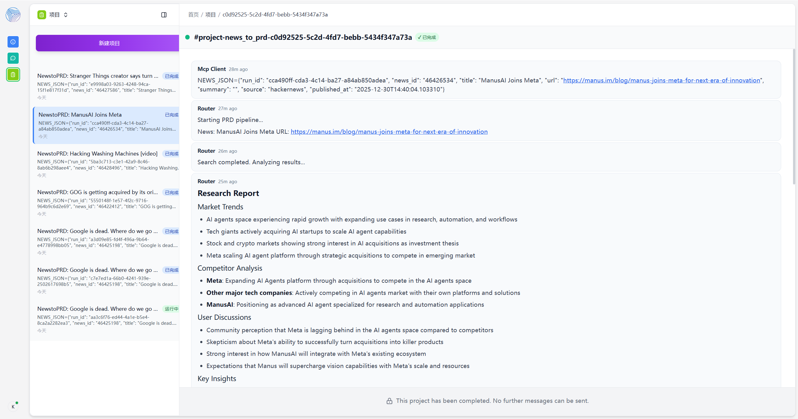
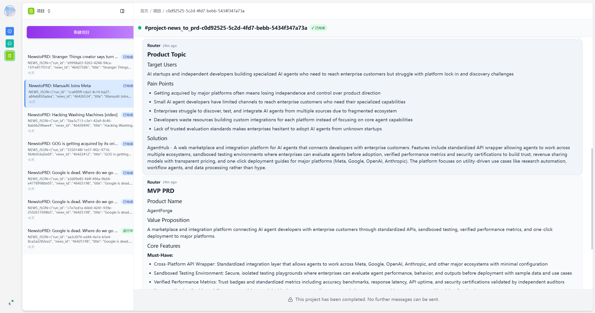
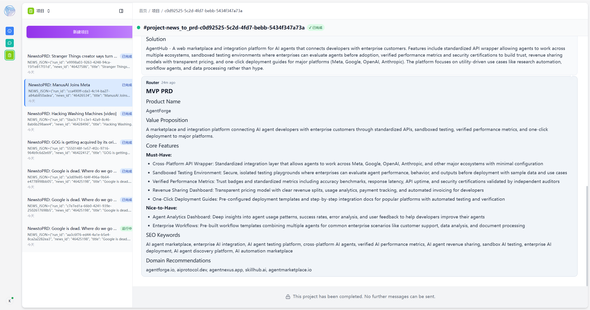

# Demo 5: NewstoPRD - 新闻到PRD自动生成流水线

从科技新闻自动生成 MVP PRD 文档的流水线 demo。整合新闻获取（demo02）和调研团队（demo03）的能力。

## 架构概览

```
┌─────────────────────────────────────────────────────────────────────────────┐
│                        NewstoPRD Network                                     │
│                                                                              │
│   news-hunter ──► router ──► web-searcher ──► analyst                       │
│       │              │                           │                          │
│       │              │◄──────────────────────────┘                          │
│       │              │                                                      │
│       │              ├──► product-insight                                   │
│       │              │           │                                          │
│       │              │◄──────────┘                                          │
│       │              │                                                      │
│       │              └──► prd-expert                                        │
│       │                      │                                              │
│       │                      ▼                                              │
│       │              ┌──────────────┐                                       │
│       │              │  MVP PRD     │                                       │
│       │              └──────────────┘                                       │
│       │                                                                     │
│       └──► prd-pipeline 频道（drop 通知）                                    │
│                                                                              │
│  端口: HTTP:8800 (Studio) | gRPC:8900                                       │
└─────────────────────────────────────────────────────────────────────────────┘
```

## 流水线阶段

1. **新闻获取**: News Hunter 从 Hacker News 获取新闻，为每条新闻创建独立 project
2. **调研阶段**: Web Searcher 搜索 → Analyst 分析 → 输出调研报告
3. **洞察阶段**: Product Insight Expert 挖掘爆款产品选题
4. **PRD 阶段**: PRD Expert 生成 MVP PRD 文档

## 运行效果展示

### 📊 调研报告


### 💡 产品洞察


### 📝 MVP PRD


## 快速开始

### 前置条件

- Python 3.9+
- OpenAgents SDK (`pip install openagents`)
- 可选: Brave Search API Key (设置 `BRAVE_API_KEY` 环境变量)

### 启动步骤

需要打开 **7 个终端窗口**，按顺序执行：

```powershell
# 1. 启动 Network
cd demos/05_news_to_prd
openagents network start --config network.yaml

# 2. 启动 Agents（在新终端窗口中）
openagents agent start --config agents/router.yaml
openagents agent start --config agents/web_searcher.yaml
openagents agent start --config agents/analyst.yaml
openagents agent start --config agents/product_insight.yaml
openagents agent start --config agents/prd_expert.yaml

# 3. 启动 News Hunter（在新终端窗口中）
# 持续运行
python agents/news_hunter.py --host localhost --port 8800

# 或单次运行
python agents/news_hunter.py --host localhost --port 8800 --run-once
```

### 访问 Studio

启动后访问 http://localhost:8800 查看 Studio 界面。

## 验证 Checkpoint

### Checkpoint 1: 新闻 → 调研报告

验证项：
- [ ] 看到新建的 project（名称以 `NewstoPRD:` 开头）
- [ ] project goal 可解析出 `NEWS_JSON`（含 run_id/title/url/news_id）
- [ ] project 内第一条消息包含新闻 title + url
- [ ] project 内出现"调研报告"输出，包含 4 个小节：
  - 市场趋势
  - 竞品分析
  - 用户讨论
  - 关键洞察

验证 drop-on-overload：
1. 修改 `network.yaml` 中 `max_concurrent_projects: 1`
2. 快速触发多条新闻
3. 验证后续新闻不会创建 project
4. 在 `prd-pipeline` 频道看到 drop 提示

### Checkpoint 2: 完整流水线

验证项：
- [ ] 依次出现 3 个阶段输出：
  1. 📊 调研报告
  2. 💡 爆款产品选题（含目标用户/用户痛点/Web解决方案）
  3. 📝 MVP PRD（含产品名称/需求文档/SEO关键词5-10个/域名推荐3-5个）
- [ ] router 成功 `complete_project`
- [ ] project summary 包含产品名与价值主张

## 配置说明

### network.yaml

```yaml
# 并发控制
max_concurrent_projects: 3  # 建议 2-3，便于观察 drop 行为

# 端口配置
transports:
  - type: "http"
    config:
      port: 8800
  - type: "grpc"
    config:
      port: 8900
```

### News Hunter 参数

```bash
python agents/news_hunter.py \
  --host localhost \
  --port 8800 \
  --interval 300 \    # 抓取间隔（秒），默认 300
  --max-news 1 \      # 每次最多处理新闻数，默认 1
  --run-once          # 单次运行模式
```

## 目录结构

```
demos/05_news_to_prd/
├── agents/
│   ├── news_hunter.py      # 新闻猎手（Python WorkerAgent）
│   ├── router.yaml         # 流水线协调器
│   ├── web_searcher.yaml   # 网络搜索专家
│   ├── analyst.yaml        # 调研分析师
│   ├── product_insight.yaml # 产品洞察师
│   └── prd_expert.yaml     # PRD专家
├── tools/
│   ├── news_fetcher.py     # 新闻获取工具
│   └── web_search.py       # 网络搜索工具
├── models/
│   └── payloads.py         # 数据模型定义
├── logs/                   # 日志目录
├── network.yaml            # 网络配置
├── CONTRACTS.md            # 关键决策与契约
└── README.md               # 本文件
```

## 常见问题

### Q: 新闻一直不触发流水线？

A: 检查以下几点：
1. News Hunter 是否成功连接到 network（查看终端输出）
2. 是否有新的未处理新闻（News Hunter 会去重）
3. 尝试使用 `--run-once` 模式立即触发

### Q: 流水线卡在某个阶段？

A: 检查对应 agent 的日志：
- `logs/llm/router.jsonl`
- `logs/llm/web-searcher.jsonl`
- `logs/llm/analyst.jsonl`
- `logs/llm/product-insight.jsonl`
- `logs/llm/prd-expert.jsonl`

### Q: 如何测试 drop-on-overload？

A: 
1. 将 `network.yaml` 中 `max_concurrent_projects` 设为 1
2. 重启 network
3. 快速触发多条新闻（可以手动调用 News Hunter 多次）
4. 观察 `prd-pipeline` 频道的 drop 通知

### Q: 搜索结果不理想？

A: 
1. 设置 `BRAVE_API_KEY` 环境变量使用 Brave Search（效果更好）
2. 如果没有 API Key，会使用 DuckDuckGo 作为备选

## 相关文档

- [CONTRACTS.md](./CONTRACTS.md) - 关键决策与契约
- [设计文档](../../.kiro/specs/news-to-prd/design.md)
- [需求文档](../../.kiro/specs/news-to-prd/requirements.md)
- [任务列表](../../.kiro/specs/news-to-prd/tasks.md)
